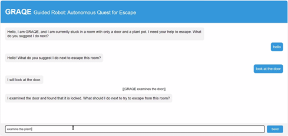

> [!NOTE]
> This experimental project is part of academic work related to computer science and artificial intelligence with an emphasis on human-computer interaction. You can read my report ["*GRAQE - Guided Robot: Autonomous Quest for Escape*"](./report.pdf) for a comprehensive overview of the research, methodology and design involved in this work, as well as observed results.

# GRAQE



> GRAQE is an experimental system taking the form of a multi-agent textual "escape game". In this system, the player will guide an AI agent through an environment and have this agent execute actions exploring further the surrounding environment. The player will get a grasp of the environment through their interactions with the AI protagonist and will attempt help them to get further, explore the various rooms and interact with their surroundings. The player is intended to give directions and recommendations to this protagonist and observe what happens to the environment.
> ["*GRAQE - Guided Robot: Autonomous Quest for Escape*"](./report.pdf)

## Setup

You need to have NodeJS installed. This project have been tested on NodeJS v18.20.2. You can [download it directly here (Windows)](https://nodejs.org/dist/v18.20.2/node-v18.20.2-x64.msi) or through the [official NodeJS.org website](https://nodejs.org/en/download).

You should have an OpenAI account and available credits, you can make a new API key here: https://platform.openai.com/api-keys.

Create a `config.json` file, as following:
```json
{
    "openaiApiKey": "..."
}
```

Run a terminal in the current folder and run the following commands:
```shell
npm install
npm run dev     # or: npm start
```

The project should then start a server on `http://localhost:3000/`. If it doesn't work, make sure the port 3000 is not already used by another software.